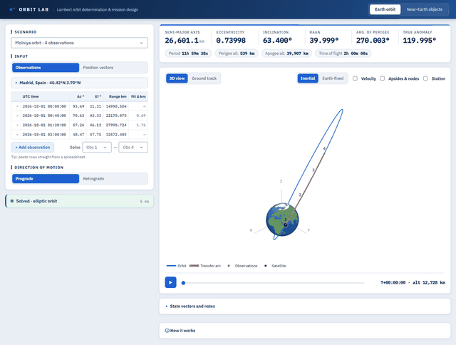

# Orbit Lab — Lambert orbit determination & NEO mission design

Orbit Lab determines satellite orbits from ground-station observations and plans missions to near-Earth asteroids, both with one verified Lambert solver.
It runs as a local web app: live 3D and ground-track views for Earth orbits, and a Sun-centred view with a porkchop planner over JPL's 42,534-asteroid catalog.



A local web app built around one verified Lambert solver (`lamsolbert`),
used in two scopes:

- **Earth orbit.** Determine a satellite's orbit from ground-station
  observations (UTC, azimuth, elevation, range) or from two position
  vectors, and explore it in 3D, on a ground track, and as an animation.
- **Near-Earth objects.** Browse JPL's catalog of 42,534 near-Earth
  asteroids, see them among the inner planets on any date, find their
  closest approach to Earth, and design Earth → asteroid transfers on a
  porkchop plot. Every cell of that plot is a Lambert problem solved with
  the same solver, using the Sun's gravitational parameter.

The orbital mechanics lives in pure-numpy modules (`core/`, `helio/`); the
user interface (`app/`) only parses inputs and draws results.

## Install and run

Python 3.10+ (developed on 3.14).

```
pip install -r requirements.txt
python main.py                  # opens http://127.0.0.1:8050
python main.py --port 8060      # another port
python main.py --no-browser
```

Everything works offline: the asteroid catalog, coastlines and land map
are bundled in `data/`. Only the web fonts and the optional "Refresh from
JPL" button use the internet.

Scripts that need no UI:

```
python assignment_answer.py     # solves the assignment data, writes assignment_answer_results.txt
python verify.py                # Lambert solver vs Vallado Example 5-5
python -m pytest tests          # 50 automated checks (see Verification)
python tests/run_stress_tests.py   # edge-case / input-validation suite, writes tests/stress_test_results.txt
python legacy/gui.py            # the original v1 Tkinter interface
```

## Using the app

### Earth orbit tab

- **Scenario** presets: Molniya, ISS-like LEO pass, GTO, GEO (all observed
  from Madrid), the assignment data (with its own station) and Vallado
  Example 5-5 (position vectors).
- **Observations** mode: an editable table; add, delete or paste rows from
  a spreadsheet and choose which two observations to solve between. The
  *Fit Δ* column propagates the solved orbit to every other observation's
  time and shows how far it passes from it. The ground station defaults to
  Madrid, Spain (40.42° N, 3.70° W) and can be edited.
- **Position vectors** mode: r₁, r₂ (ECI, km), time of flight and an
  optional epoch; the *Scale time of flight* slider reshapes the transfer
  live.
- The orbit re-solves as you type; invalid cells turn red and the status
  line says what is wrong.
- **Views:** 3D (inertial or Earth-fixed) with optional velocity vectors,
  apsides and line of nodes, and ground-station lines of sight; or a ground
  track. Play / scrub the time bar to animate the satellite and Earth's
  rotation. Warnings appear when a trajectory hits the Earth or escapes.
- **Export:** camera icon on the plot (PNG); *State vectors and notes →
  Download results (.csv)*.

### Near-Earth objects tab

- **Catalog:** search by name or designation, filter by orbit class
  (Atira, Aten, Apollo, Amor) or show only potentially hazardous asteroids
  (orange), sort by any column. Click a row, or click an asteroid in the 3D
  view, to select it.
- **Object panel:** orbital elements, size, brightness, Earth MOID, the
  epoch of the elements, and the **closest approach to Earth** in the next
  four years with a *Go to this date* button (Apophis: 13–14 April 2029).
- **Solar system view:** the Sun, Mercury–Mars, the selected orbit and up
  to 1,500 catalog asteroids; play or scrub a four-year date slider, or
  type a date to jump to it.
- **Mission design view:** a porkchop plot over departure date × time of
  flight, coloured by total Δv, launch energy C3 or arrival speed. The best
  transfer is starred; click anywhere to pick another; *Show in solar
  system* draws it with an animated spacecraft. *Download (.csv)* and *Save
  image* export the result.

## Project layout

```
core/            verified orbital mechanics, no UI
  constants.py   Earth / Sun constants, AU
  time_utils.py  UTC -> Julian Date -> GMST
  frames.py      station ECEF <-> geodetic, AER <-> ECI, ECI -> ECEF -> lat/lon
  lamsolbert.py  Lambert's problem (universal variables)
  elements.py    state vector -> classical orbital elements
  kepler.py      Kepler's equation, elements -> state, state propagation
  solve.py       observations -> Lambert -> elements pipeline (used by the UI)
helio/           Sun-centred scope
  planets.py     planet positions (JPL approximate elements, 1800-2050)
  neo_catalog.py JPL SBDB near-Earth asteroid catalog: load, filter, refresh
  porkchop.py    transfer grids, best-transfer refinement, closest approach
app/             Dash web UI (earth_page, neo_page, figures, presets, assets/)
data/            bundled catalog, coastlines, land mask
tools/           build_land_mask.py (regenerates data/land_mask_1deg.json)
docs/            orbit_lab_demo.gif (the tour at the top of this README)
tests/           pytest suites + stress-test runner
legacy/          original Tkinter GUI (v1)
```

## Method

**Time.** Each observation's UTC time is converted to a Julian Date and to
Greenwich Mean Sidereal Time (IAU 1982 polynomial). GMST is computed for
every observation separately, since the Earth turns ~15° per hour.

**Frames.** Azimuth/elevation/range → topocentric SEZ → Earth-fixed (using
the station's WGS84 geodetic latitude/longitude) → inertial ECI (rotation
by that observation's GMST). The inverse chain (ECI → ECEF → latitude,
longitude, altitude, and ECI → Az/El/Range) is used for ground tracks and
to generate the synthetic presets.

**Lambert's problem (`core/lamsolbert.py`).** Universal-variable
formulation (Vallado Alg. 58, Curtis Alg. 5.2): the Stumpff functions C(z),
S(z) and a root-find of the time-of-flight equation t(z) = Δt. The
direction of motion (prograde / retrograde) selects the transfer angle, so
transfers over 180° are handled. Only the zero-revolution solution is
computed. The root-find is a safeguarded Newton iteration: Newton steps
inside a bracket [z_lo, z_hi] where t(z) is monotonic, bisection whenever a
step would leave it.

**Orbital elements (`core/elements.py`).** Angular-momentum /
eccentricity-vector formulation; near-circular and near-equatorial orbits
report undefined angles with an explanation rather than a wrong number.

**Propagation (`core/kepler.py`).** Kepler's equation for elliptic
elements; universal-variable propagation of a state vector (Lagrange f, g)
for any conic, with a bracketed Newton solve.

**Heliocentric scope (`helio/`).** Planets from JPL's approximate
Keplerian elements and rates (Standish, valid 1800–2050; "Earth" is the
Earth–Moon barycentre). Asteroids from JPL Small-Body Database osculating
elements (ecliptic J2000), propagated with two-body motion about the Sun.
A porkchop cell solves Lambert from Earth at departure to the asteroid at
arrival: C3 = |v₁ − v_Earth|², arrival v∞ = |v₂ − v_asteroid|, total Δv =
departure + arrival v∞ (rendezvous, excluding Earth escape and capture).
The grid minimum is refined with SciPy's Nelder–Mead; closest approach is
a daily scan refined with a bounded scalar minimisation.

## Verification

`python -m pytest tests` runs 50 checks, including:

- Lambert vs **Vallado Example 5-5**; the **assignment answer** is
  unchanged from v1 (a = 28,196.776 km, e = 0.767944, i = 20.315°).
- **Every Lambert solution propagated forward** by its time of flight must
  land on r₂: 600 random Earth-orbit and heliocentric geometries, including
  transfers over 180°; worst miss ~10⁻¹¹ relative. Also checks that it is
  the zero-revolution solution.
- Propagation vs **Vallado Example 2-4**; round trips; full periods;
  hyperbolic energy conservation.
- Frame round trips (AER ↔ ECI, geodetic ↔ ECEF).
- Presets: each synthetic scenario solves back to the orbit it was
  generated from.
- Planets and asteroids (Eros, Apophis) vs **JPL Horizons** vectors.
- Porkchop minimum for a circular 1.524 AU target vs the **Hohmann
  transfer** (5.59 km/s, ~259 days).
- Catalog classes vs JPL's class definitions.
- The browser's JavaScript propagator vs the Python one (run with Node.js).

`tests/run_stress_tests.py` covers edge cases and input validation: degenerate
geometries, extreme orbits and times of flight, invalid inputs to every form
in the web UI (fed directly to the Dash callbacks), invalid porkchop windows,
unusual asteroids, and an offline catalog refresh.

## Findings worth noting

- **v1 solver drifted onto multi-revolution roots.** In the stress test's
  5-hour case, the original unbracketed Newton iteration converged to a
  solution completing 1.84 revolutions (|v₁| = 8.573 km/s), contradicting
  the solver's single-revolution design. The bracketed version returns the
  zero-revolution transfer (|v₁| = 9.396 km/s, 0.93 of a period). It is
  also ~15× faster on heliocentric transfers (0.17 ms per solve), because
  the old fixed 10⁻⁸ s tolerance was below double precision at
  Δt ~ 10⁷ s and every call fell through to a 2,000-point grid search.
- **Vallado Example 5-5's transfer passes 3,192 km below the Earth's
  surface**: a pure Lambert geometry exercise. The app flags such cases.
- **Observations from different passes** (more than one orbit apart)
  cannot be joined by a zero-revolution Lambert solve.
- **Apophis 2029.** Two-body propagation from the catalog elements gives a
  closest approach of 30,623 km (to the Earth–Moon barycentre) on
  2029-04-14 01:10 UTC; the actual flyby is ~38,000 km from Earth's centre
  on 13 April 21:46 UTC, a difference due to ignoring the Earth's (and
  Moon's) gravity on the asteroid.
- **Best Apophis rendezvous** in the default window: depart 2027-06-17,
  304 days, C3 = 2.08 km²/s², total Δv = 4.37 km/s.
- **Optimiser precision at large Julian Dates.** SciPy's bounded
  minimiser adds a tolerance proportional to |x|; at JD ≈ 2.46 × 10⁶ that
  is ~0.04 days, enough to misplace a flyby minimum by ~1,000 km.
  Optimising in days from a nearby reference fixes it.

## Assumptions and limitations

- Two-body motion throughout: no J2, drag, solar pressure or third bodies.
  Asteroid positions degrade away from their elements' epoch (shown in the
  object panel); e.g. Bennu's 2011 elements drift ~1.8° by 2026.
- UTC is used as UT1 for sidereal time (sub-second effect).
- The station's ECEF coordinates are valid at every observation time
  (fixed ground station).
- Zero-revolution Lambert only; multi-revolution transfers are not solved.
- Porkchop Δv excludes Earth-departure and asteroid-capture burns; the
  planet ephemeris limits windows to 1800–2050.

## Data sources

- Asteroids: NASA/JPL Small-Body Database Query API,
  https://ssd-api.jpl.nasa.gov/doc/sbdb_query.html (snapshot in
  `data/neo_asteroids.csv.gz`; refreshed copies go to
  `data/neo_asteroids_latest.csv.gz`, not tracked by git).
- Planets: E. M. Standish, *Keplerian Elements for Approximate Positions of
  the Major Planets*, JPL/SSD.
- Reference vectors in tests: JPL Horizons.
- Coastlines and land: Natural Earth 1:110m (public domain).
- Vallado, *Fundamentals of Astrodynamics and Applications*; Curtis,
  *Orbital Mechanics for Engineering Students*.
